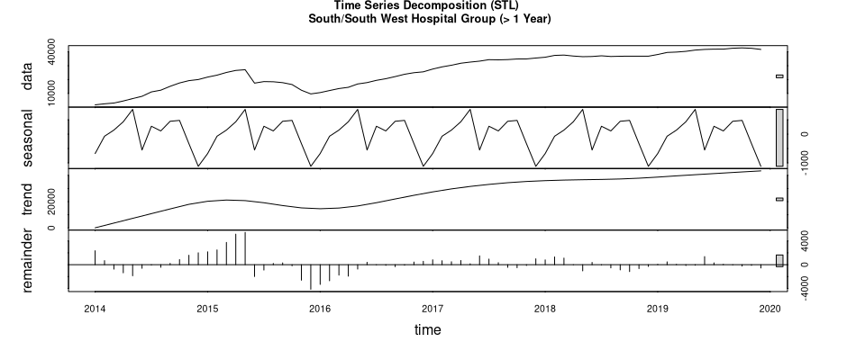

<style type="text/css">

code.r{
  font-size: 12px;
}
</style>

\setcounter{page}{1}
```{r setup, include=FALSE}
knitr::opts_knit$set(root.dir = "/home/danny/MEGA/College/msc_data_analytics/data_science/ca3/hospital_waiting_lists")
```
```{r include=FALSE}
library(kableExtra)
library(dplyr)
source("helpers/data_prep_helper.R")
source("helpers/descriptive_statistics_helper.R")
```

\begingroup
\setlength{\tabcolsep}{15pt} 
\renewcommand{\arraystretch}{1.5} 
  \begin{tabular}[]{@{}ll@{}}
    \bf Title:      & Trends in Irish hospital waiting list figures \\
    \bf Author:     & Danny Regan \\
    \bf Supervisor: & Dr James Connolly \\
    \bf Degree:     & MSc in Big Data Analytics \\
    \bf Module:     & Data Science \\
    \bf Github:     & \url{https://github.com/ancodia/hospital_waiting_lists}
  \end{tabular}
\endgroup

# Abstract
 Lorem ipsum dolor sit amet, consectetur adipiscing elit. Quisque at turpis eget ligula vestibulum blandit sed ut quam. Morbi scelerisque ornare odio sed commodo. Cras non nisi et nibh tristique tempor. Donec hendrerit risus dictum lectus rutrum, vel maximus lectus pharetra. Praesent lectus elit, tristique non ante nec, bibendum accumsan odio. Interdum et malesuada fames ac ante ipsum primis in faucibus. Phasellus sagittis mauris rhoncus est ultricies aliquet. Pellentesque in sapien eu lacus tincidunt commodo vel vel tellus. Pellentesque semper convallis dui a congue.

Ut finibus ante mi, ac ornare nisl vestibulum ac. Nunc volutpat at orci vel rutrum. Nam blandit enim nec nunc finibus, nec dignissim est imperdiet. Donec id rutrum ex, et mattis leo. Nulla elementum augue id convallis ullamcorper. Pellentesque non egestas libero. Mauris dolor ex, mattis a pellentesque sed, consectetur nec sapien. Vivamus sit amet condimentum est, sed aliquam ipsum. Nunc in ipsum sed urna aliquam euismod nec sit amet arcu. Fusce ac lorem quis massa imperdiet mattis in ut lectus. Etiam nulla arcu, aliquam ac mauris sit amet, fermentum fermentum risus. Praesent eu cursus dolor, eget egestas augue. Duis vitae maximus lectus. 

\newpage

# Introduction
The volume of patients waiting for hospital procedures and the length of these waits constitute a major shortfall in the Irish public healthcare system. According to the most recent Euro Health Consumer Index [@health_consumer_powerhouse_euro_2018, p.15], Ireland has the longest waiting times in Europe despite having one of the greatest levels of expenditure on health [@oecd_health_2018, p.133]. 

The National Treatment Purchase Fund (NTPF) is the organisation assigned the task by the Irish government of collecting, collating and validating data about individuals who are waiting for treatment in public hospitals. This is the source of data for the current project.

A description of the data and steps taken to clean it are the feature of the next section. This data description section also includes justification for choices of statistical methods to aid in answering the research question displayed below. The sections that follow cover hypothesis testing for the waiting list data and then the application of the chosen analytic techniques with reporting and discussion of results included.

## Research Question:
The NTPF waiting list data will be used in this project to answer the following research question:

> What differences, if any, exist among trends found in Irish hospital group waiting list figures from recent years?

# Data Description
The data for this project comes from that collected by NTPF for outpatient (OP) [^1], inpatient/day case (IPDC) [^2] and GI endoscopy (IPDC GI) [^3] waiting list numbers for all public hospitals across Ireland. The data that is being considered is monthly totals from January 2014 to December 2019. This section describes how the data was prepared for analysis and which statistical methods were chosen to assist in answering the research question.

[^1]: Outpatient Waiting Lists: https://data.ehealthireland.ie/dataset/op-waiting-list-by-group-hospital

[^2]: Inpatient and Day case Waiting Lists: https://data.ehealthireland.ie/dataset/ipdc-waiting-list-by-group-hospital

[^3]: GI Endoscopy Waiting Lists: https://data.ehealthireland.ie/dataset/ipdc-gi-endoscopy-by-group-hospital

```{r include=FALSE}
columns_ipdc <- c("Archive_Date",
                  "Hospital_Group",
                  "Hospital_HIPE",
                  "Hospital_Name",
                  "Speciality_HIPE",
                  "Speciality_Name",
                  "Case_Type",
                  "Adult_Child",
                  "Age_Profile",
                  "Time_Bands",
                  "Total")

#######################################
# outpatient data columns
#######################################
# names:
# no case type in outpatients waiting list data
columns_op <- columns_ipdc[columns_ipdc != "Case_Type"]

# load data from csv files
# inpatient/day case waiting lists
ipdc_data <- combine_csv_data("datasets/ipdc", 
                              column_names = columns_ipdc)
nrow(ipdc_data)
# inpatient/day case waiting lists for GI Endoscopy patients
ipdc_gi_data <- combine_csv_data("datasets/ipdc_gi", 
                                 column_names = columns_ipdc)
nrow(ipdc_gi_data)
# out patient waiting lists
op_data <- combine_csv_data("datasets/op", 
                            column_names = columns_op)
# add Case_Type which will be NA for all out patient records
op_data$Case_Type <- NA
nrow(op_data)

# combine all waiting list data
all_waiting_lists <- bind_rows(list(ipdc_data, ipdc_gi_data, op_data))
# sort by descending archive data
all_waiting_lists <- all_waiting_lists[
  order(all_waiting_lists$Archive_Date, decreasing = TRUE),]

row_counts <- data.frame(c("OP:", "IPDC:", "IPDC GI:", "Overall:"),
                         c(nrow(op_data), nrow(ipdc_data), nrow(ipdc_gi_data), nrow(all_waiting_lists)))
colnames(row_counts) <- c("Waiting list", "Patient count")
```
```{r echo=FALSE}
kable(row_counts, format="latex", booktabs=TRUE, caption = "Waiting list counts.") %>%
  row_spec(3, hline_after = TRUE) %>%
  kable_styling("striped", position = "center")
```

## Data Cleaning
### Amalgamating source data
The first step taken was to combine all data into a single dataset. This was accomplished by initially combining all csv files for each waiting list category with the `combine_csv_data()` function in `helpers/data_prep_helper.R` which uses the `vroom` package. Then the 3 resulting tibbles are combined with `dplyr::bindrows`. The row counts for the individual and combined datasets can be seen in Table 1 while Table 2 shows a sample of rows from the overall data. The format of archive dates varies between Y-m-d and d/m/Y so the `convert_dates()` function that makes use of `libridate::parse_date_time` to convert all to a single datetime format was added to the `data_prep_helper.R` helper file.

```{r echo=FALSE}
kable(all_waiting_lists[sample(nrow(all_waiting_lists), 15), ], 
      format="latex", booktabs=TRUE, caption = "Random sample of rows from the combined data.") %>% 
  row_spec(0, angle = 45) %>%
  kable_styling("striped", latex_options=c("scale_down", "hold_position"), position = "center", full_width = FALSE)
```


```{r missing_values, echo=FALSE, fig.align= "center", fig.cap="Missing values."}
missing_values <- aggr(all_waiting_lists, prop = FALSE, 
                       numbers = TRUE,
                       labels = names(all_waiting_lists),
                       cex.axis = .9, oma = c(7,5,3,3),
                       )
```
### Dealing with missing values
Figure 1 displays the missing values from the combined data. The following steps were taken to handle these.

The missing case types are expected for all outpatient records because that column does not exist in the source csv so those are assigned a value of "Outpatient":
\small
```{r}
all_waiting_lists$Case_Type[is.na(all_waiting_lists$Case_Type)] <- "Outpatient" 
```
\normalsize

There are 6 blank records introduced from the source datasets explaining the missing values for Archive_Date, Hospital_Group, Hospital_HIPE, Hospital_Name, Speciality_HIPE, Speciality_Name, Time_Bands and Total so these are dropped:
```{r}
all_waiting_lists <- subset(all_waiting_lists, 
                            !is.na(all_waiting_lists$Hospital_Name))
nrow(all_waiting_lists)
```

The 1 remaining row with a missing Time_Bands value is also removed because time band is vital for the analysis that follows:
\small
```{r}
nrow(all_waiting_lists)
all_waiting_lists <- all_waiting_lists[!is.na(all_waiting_lists$Time_Bands),]
nrow(all_waiting_lists)
```
\normalsize
All other missing values are deemed irrelevant for the current project, so no action is taken.

### Time band formatting
The time bands variable originally had variation of the sample values:
\small
```{r}
unique(all_waiting_lists[, c("Time_Bands")])
```
\normalsize
To rectify these differences whitespace was removed from all and the format for "18+ months" was standardised:
```{r}
all_waiting_lists$Time_Bands <- as.character(all_waiting_lists$Time_Bands)
all_waiting_lists$Time_Bands <- trimws(all_waiting_lists$Time_Bands)
all_waiting_lists$Time_Bands[
  all_waiting_lists$Time_Bands == "18 Months +"] <- "18+ Months"
```

With the result looking like so:
\small
```{r}
unique(all_waiting_lists[, c("Time_Bands")])
```
\normalsize
To perform the analysis for answering the defined research question it was decided to reduce time band to 2 groupings, less than a year and greater than a year waiting:
\small
```{r include=FALSE}
attach(all_waiting_lists)
# < 1 year
all_waiting_lists$Time_Bands[
  Time_Bands == "0-3 Months" | 
    Time_Bands == "3-6 Months" |
    Time_Bands == "6-9 Months" |
    Time_Bands == "9-12 Months"] <- "< 1 Year"
# > 1 year
all_waiting_lists$Time_Bands[
  Time_Bands == "12-15 Months" | 
    Time_Bands == "15-18 Months" |
    Time_Bands == "18+ Months"] <- "> 1 Year"
detach(all_waiting_lists)
all_waiting_lists$Time_Bands <- as.factor(all_waiting_lists$Time_Bands)
```
```{r}
unique(all_waiting_lists[, c("Time_Bands")])
```
\normalsize

### Removal of unnecessary variables
Columns that aren't necessary for this project were removed for the dataset. The analysis will examine trends by using the 7 hospital groups and the 2 newly created waiting list time band so only Archive_Date, Hospital_Group, Time_Bands and Total variables are kept.

Structure before removal:
\small
```{r}
str(all_waiting_lists, width = 70, strict.width = "cut")
```
```{r include=FALSE}
all_waiting_lists <- select(all_waiting_lists, -c(Hospital_HIPE,
                                                  Hospital_Name,
                                                  Speciality_HIPE,
                                                  Speciality_Name,
                                                  Case_Type,
                                                  Adult_Child,
                                                  Age_Profile))
```
\normalsize
After removal:
\small
```{r}
str(all_waiting_lists, width = 70, strict.width = "cut")
```
\normalsize

### Final clean up
The final steps in the data cleaning process involved abbreviating the hospital group names and excluding records from 2020 in the data as these only consist of January figures. The name abbreviation was done to accomodate displaying the names in charts that follow. 

Note: The Children's Hospital Group was renamed to Children's Health Ireland in 2018 so these are classed as a single group.

Original hospital group names:
\small
```{r}
unique(all_waiting_lists[, c("Hospital_Group")])
```
```{r include=FALSE}
# combining the Children's Hospital Group and Children's Health Ireland, 
# all fall under CHI since 2018
# Shorten names of all other hospital groups
attach(all_waiting_lists)
all_waiting_lists$Hospital_Group[
  Hospital_Group == "Children's Hospital Group"] <- "CHI"
all_waiting_lists$Hospital_Group[
  Hospital_Group == "Children's Health Ireland"] <- "CHI"
all_waiting_lists$Hospital_Group[
  Hospital_Group == "Dublin Midlands Hospital Group"] <- "Dublin Midlands"
all_waiting_lists$Hospital_Group[
  Hospital_Group == "Ireland East Hospital Group"] <- "Ireland East"
all_waiting_lists$Hospital_Group[
  Hospital_Group == "RCSI  Hospitals Group"] <- "RCSI"
all_waiting_lists$Hospital_Group[
  Hospital_Group == "Saolta University Health Care Group"] <- "Saolta"
all_waiting_lists$Hospital_Group[
  Hospital_Group == "University of Limerick Hospital Group"] <- "UL"
all_waiting_lists$Hospital_Group[
  Hospital_Group == "South/South West Hospital Group"] <- "South/South West"
detach(all_waiting_lists)

str(all_waiting_lists)
# aggregate totals based on length on waiting list
all_waiting_lists <- aggregate(cbind(Total) ~ 
                                 Time_Bands + 
                                 Hospital_Group + 
                                Archive_Date, 
                               data = all_waiting_lists, sum)
```
\normalsize
Abbreviated hospital group names:
\small
```{r}
unique(all_waiting_lists[, c("Hospital_Group")])
```
\normalsize

\newpage
## Choice of Statistical Methods
Figure 2 shows all waiting lists plotted as a bar chart to give a general view of how the data has changed over time. The trend here appears to be generally ever growing numbers of patients waiting more than a year for procedures while those waiting less than a year saw a steady increase from 2014 to 2017 and a stabling thereafter. 
```{r totals_img, fig.align = "center", out.width="70%", out.height="70%", fig.cap = "Totals waiting list numbers by year.", echo = FALSE, fig.pos="h"}
knitr::include_graphics(here::here("documentation/images", "waiting_list_totals.png"))
```

To help decide what type of statistical methods are suitable for use of this data, density plots for each hospital group were generated (Figure 3). All groups have have skewed distributions meaning some type of non-parametric method must be used.
```{r densities_img, fig.align = "center", fig.cap = "Density plot for each Irish hospital group.", echo = FALSE}
knitr::include_graphics(here::here("documentation/images", "densities.png"))
```

Based on the data being time series in nature and not normally distributed the chosen statistical tests to answer the research question are the Mann-Kendall test to determine if montonic trends are present and Sen's slope test to determine the magnitude of trends if they exist.

# Hypothesis Testing
The hypothesis being tested on the waiting list time series data with the stated statistical methods is as follows:

$H_0$: No monotonic trend exists
$H_1$: Monotonic trend exists

The `Kendall` R package...

To perform the Sen's slope test the `trend` package was...

The overall data is split into individual datasets for each hospital group in order to facilitate testing. The next section discusses the results obtained by using the combined tests and provides graphs of the decomposition of each time-series.

\newpage
# Results

### All Groups:


\center __Mann-Kendall Test:__ \center

Score:          p-value (2-sided): 
-------------   -------------------
232             0.26146           

\center __Sen's Slope Test:__ \center

Sen's slope:    p-value: 
-------------   -------------------
58.38278        0.2615   

Mann-Kendall Test:
tau = 0.0908, 2-sided pvalue =0.26146
S: 232
Variance of S: 42316

Sen's slope:
z = 1.1229, n = 72, p-value = 0.2615
alternative hypothesis: true z is not equal to 0
95 percent confidence interval:
 -42.92857 174.47458
sample estimates:
Sen's slope 
   58.38278 


------------------------------------
Mann-Kendall Test:
tau = 0.424, 2-sided pvalue =1.1921e-07
S: 1084
Variance of S: 42316

------------------------------------

Sen's slope:
z = 5.2647, n = 72, p-value = 1.404e-07
alternative hypothesis: true z is not equal to 0
95 percent confidence interval:
  42.81818 126.17949
sample estimates:
Sen's slope 
   77.89479 
   

### Children's Health Ireland:

------------------------------------
Mann-Kendall Test:
tau = 0.59, 2-sided pvalue =< 2.22e-16
S: 1508
Variance of S: 42316

------------------------------------
Sen's slope:
z = 7.3259, n = 72, p-value = 2.373e-13
alternative hypothesis: true z is not equal to 0
95 percent confidence interval:
  69.32353 152.55556
sample estimates:
Sen's slope 
   126.6111 


------------------------------------
Mann-Kendall Test:
tau = 0.876, 2-sided pvalue =< 2.22e-16
S: 2238
Variance of S: 42316

------------------------------------

Sen's slope:
z = 10.875, n = 72, p-value < 2.2e-16
alternative hypothesis: true z is not equal to 0
95 percent confidence interval:
 294.8261 334.4231
sample estimates:
Sen's slope 
   312.9069

### Dublin Midland Hospital Group:


------------------------------------
Mann-Kendall Test:
tau = 0.769, 2-sided pvalue =< 2.22e-16
S: 1966
Variance of S: 42316

------------------------------------

Sen's slope:
z = 9.5524, n = 72, p-value < 2.2e-16
alternative hypothesis: true z is not equal to 0
95 percent confidence interval:
 137.8333 181.7857
sample estimates:
Sen's slope 
   158.6897 
   


------------------------------------
Mann-Kendall Test:
tau = 0.821, 2-sided pvalue =< 2.22e-16
S: 2098
Variance of S: 42316

------------------------------------

Sen's slope:
z = 10.194, n = 72, p-value < 2.2e-16
alternative hypothesis: true z is not equal to 0
95 percent confidence interval:
 382.5000 459.6316
sample estimates:
Sen's slope 
    415.794 

### Ireland East Hospital Group:


------------------------------------
Mann-Kendall Test:
tau = 0.853, 2-sided pvalue =< 2.22e-16
S: 2180
Variance of S: 42316

------------------------------------

Sen's slope:
z = 10.593, n = 72, p-value < 2.2e-16
alternative hypothesis: true z is not equal to 0
95 percent confidence interval:
 332.0000 377.6875
sample estimates:
Sen's slope 
    354.628 
    


------------------------------------
Mann-Kendall Test:
tau = 0.905, 2-sided pvalue =< 2.22e-16
S: 2314
Variance of S: 42316

------------------------------------

Sen's slope:
z = 11.244, n = 72, p-value < 2.2e-16
alternative hypothesis: true z is not equal to 0
95 percent confidence interval:
 493.4909 554.6400
sample estimates:
Sen's slope 
   515.5644 

### RCSI Hospitals Group:


------------------------------------
Mann-Kendall Test:
tau = 0.346, 2-sided pvalue =1.7643e-05
S: 884
Variance of S: 42316

------------------------------------

Sen's slope:
z = 4.2925, n = 72, p-value = 1.767e-05
alternative hypothesis: true z is not equal to 0
95 percent confidence interval:
 36.77778 95.78846
sample estimates:
Sen's slope 
    65.9473 
    


------------------------------------
Mann-Kendall Test:
tau = 0.254, 2-sided pvalue =0.0016596
S: 648
Variance of S: 42316

------------------------------------

Sen's slope:
z = 3.1452, n = 72, p-value = 0.00166
alternative hypothesis: true z is not equal to 0
95 percent confidence interval:
  41.9500 154.6111
sample estimates:
Sen's slope 
   103.6165 

### Saolta University Health Care Group:

------------------------------------
Mann-Kendall Test:
tau = 0.799, 2-sided pvalue =< 2.22e-16
S: 2042
Variance of S: 42316

------------------------------------

Sen's slope:
z = 9.9218, n = 72, p-value < 2.2e-16
alternative hypothesis: true z is not equal to 0
95 percent confidence interval:
 203.4872 261.2941
sample estimates:
Sen's slope 
   235.4559 
   

------------------------------------
Mann-Kendall Test:
tau = 0.813, 2-sided pvalue =< 2.22e-16
S: 2078
Variance of S: 42316

------------------------------------

Sen's slope:
z = 10.097, n = 72, p-value < 2.2e-16
alternative hypothesis: true z is not equal to 0
95 percent confidence interval:
 343.6 417.5
sample estimates:
Sen's slope 
   382.6728 

### University of Limerick Hospital Group:


------------------------------------
Mann-Kendall Test:
tau = 0.842, 2-sided pvalue =< 2.22e-16
S: 2152
Variance of S: 42316

------------------------------------

Sen's slope:
z = 10.457, n = 72, p-value < 2.2e-16
alternative hypothesis: true z is not equal to 0
95 percent confidence interval:
 153.9362 201.1639
sample estimates:
Sen's slope 
   171.6905 
   

------------------------------------
Mann-Kendall Test:
tau = 0.941, 2-sided pvalue =< 2.22e-16
S: 2404
Variance of S: 42316

------------------------------------

Sen's slope:
z = 11.682, n = 72, p-value < 2.2e-16
alternative hypothesis: true z is not equal to 0
95 percent confidence interval:
 273.9123 294.2500
sample estimates:
Sen's slope 
   284.2346 

### South/South West Hospital Group:

------------------------------------
Mann-Kendall Test:
tau = 0.364, 2-sided pvalue =6.1989e-06
S: 931
Variance of S: 42315

------------------------------------

Sen's slope:
z = 4.521, n = 72, p-value = 6.154e-06
alternative hypothesis: true z is not equal to 0
95 percent confidence interval:
  88.61538 174.45714
sample estimates:
Sen's slope 
   134.2022 
   

------------------------------------
Mann-Kendall Test:
tau = 0.826, 2-sided pvalue =< 2.22e-16
S: 2110
Variance of S: 42316

------------------------------------

Sen's slope:
z = 10.252, n = 72, p-value < 2.2e-16
alternative hypothesis: true z is not equal to 0
95 percent confidence interval:
 461.3333 584.3929
sample estimates:
Sen's slope 
   521.4249 

# Conclusions

# References

